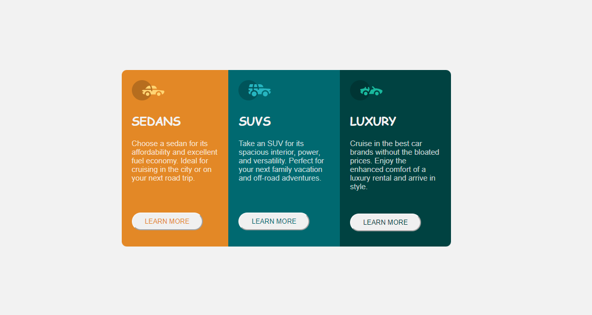

# Frontend-mentor-3-column-card-preview

This is a solution to the [3-column preview card component challenge on Frontend Mentor](https://www.frontendmentor.io/challenges/3column-preview-card-component-pH92eAR2-). Frontend Mentor challenges help you improve your coding skills by building realistic projects. 

## Table of contents

- [Overview](#overview)
  - [The challenge](#the-challenge)
  - [Screenshot](#screenshot)
  - [Links](#links)
- [My process](#my-process)
  - [Built with](#built-with)
  - [What I learned](#what-i-learned)
- [Author](#author)


## Overview

### The challenge

Users should be able to:

- View the optimal layout depending on their device's screen size
- See hover states for interactive elements

### Screenshot



### Links

- Solution URL:(https://www.frontendmentor.io/solutions/solution-using-using-css-flexbox-T_MEI7lFOC)
- Live Site URL:(https://inioluwa2003.github.io/Frontend-mentor-3-column-card-preview/)

## My process

### Built with

- Semantic HTML5 markup
- CSS custom properties
- Flexbox

### What I learned

I learnt how to use media queries

```css
.proud-of-this-css 
@media(max-width: 400px){
    main{
        width: 300px;
        display: grid;
        margin: 50px 0;
    }
    .sedan{
        border-radius: 10px 10px 0 0;
    }
    .luxury{
        border-radius: 0 0 10px 10px;
    }
}
```

## Author

- Frontend Mentor - [@Inioluwa2003](https://www.frontendmentor.io/profile/Inioluwa2003)
- Twitter - [@ini_adeyemo](https://www.twitter.com/ini_adeyemo)
